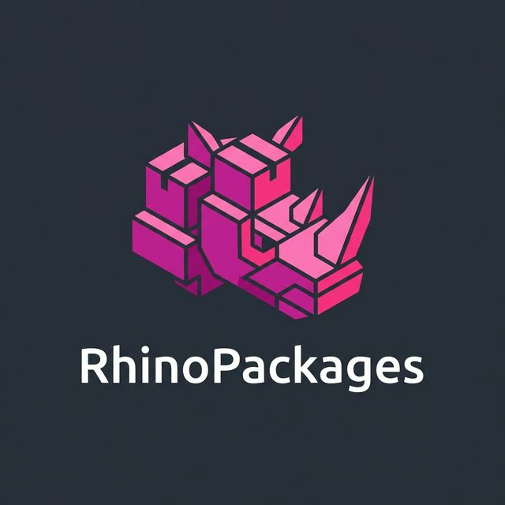

# RhinoPackages

A community-maintained directory of [Rhino 3D](https://www.rhino3d.com/) packages, with richer metadata than the built-in `_PackageManager` command.

🌐 **[rhinopackages.github.io](https://rhinopackages.github.io)**

---

## Features

- 🔍 **Instant search** — live-filtering with 300ms debounce
- 📊 **Trending sort** — HackerNews-style gravity algorithm combining downloads × recency
- 🌗 **Dark mode** — full system/light/dark toggle powered by `next-themes`
- 📈 **Directory stats** — total packages, total downloads, and monthly-updated counts
- 🖥️ **Platform filters** — Windows, Mac, Rhino 6/7/8, Rhino plugin, Grasshopper
- 👤 **Owner filter** — click any author name to filter by publisher
- 📦 **One-click install** — `rhino://package/search?name=…` deep-links

## Architecture

| Project | Description |
|---|---|
| `RhinoPackages.Generator` | C# console app that fetches package metadata from the Yak API and writes `data.json` |
| `RhinoPackages.Web` | Next.js 14 static site that reads `data.json` and renders the directory |
| `RhinoPackages.Tests` | xUnit tests for the generator with mocked HTTP handlers |

## How It Works

1. A GitHub Actions workflow runs daily (or on push to `main`).
2. The C# generator fetches all packages from the [Yak API](https://yak.rhino3d.com) and saves `data.json` into `RhinoPackages.Web/public/`.
3. Next.js exports a fully static site and deploys it to GitHub Pages.
4. A GitHub Release is created automatically for each successful deploy.

## Development

```bash
# Run the web frontend locally
cd RhinoPackages.Web
npm install
npm run dev

# Run the generator locally
cd RhinoPackages.Generator
dotnet run

# Run tests
cd RhinoPackages.Tests
dotnet test
```

## License

[MIT](LICENSE)
